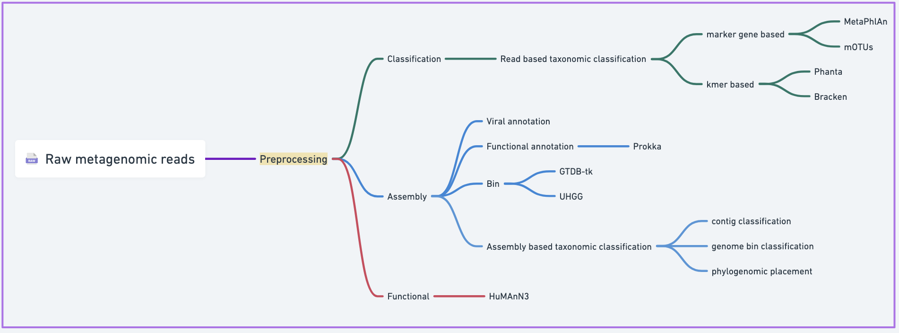
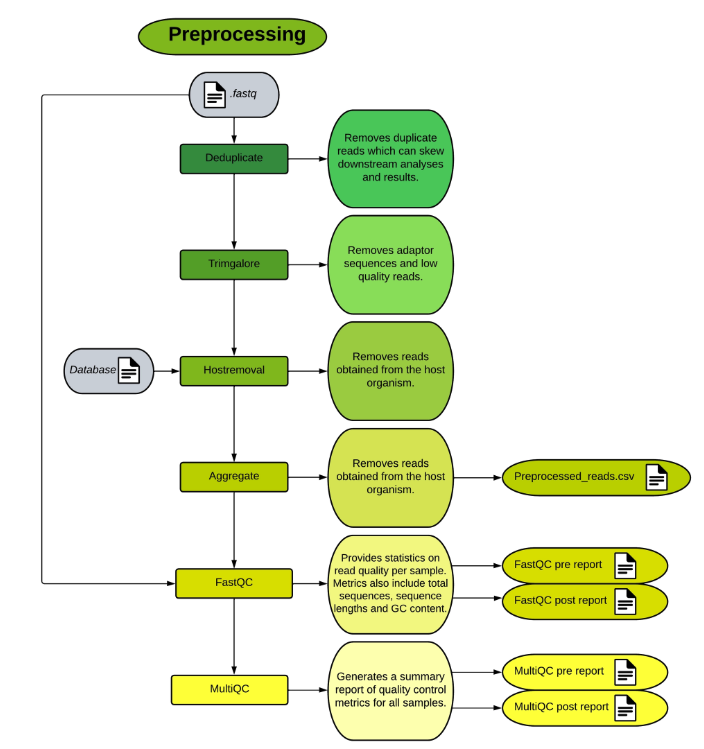
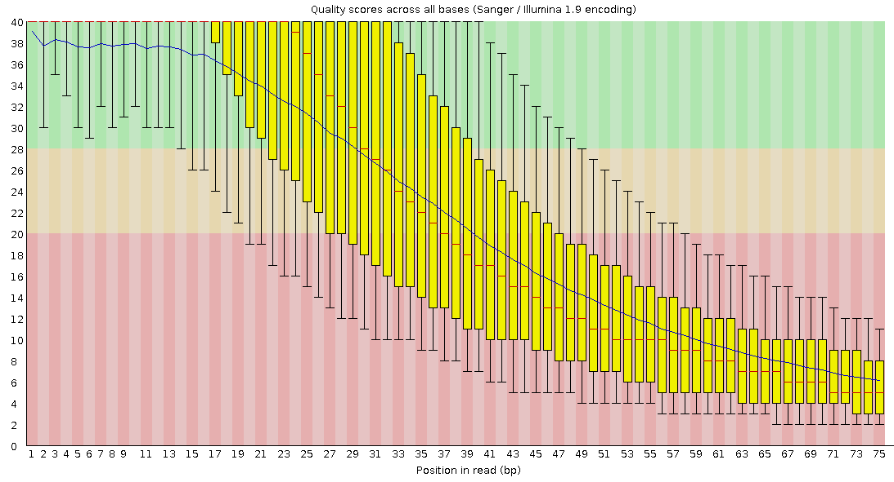
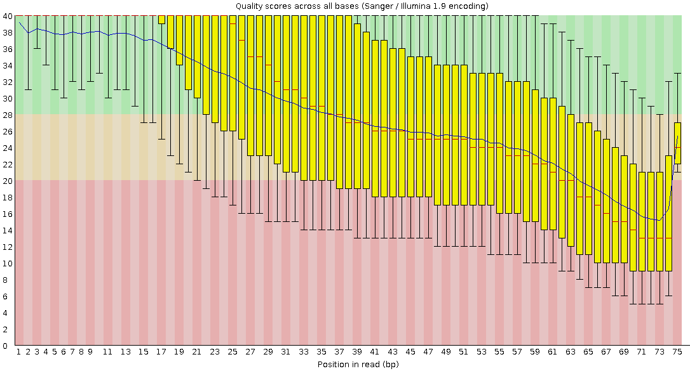
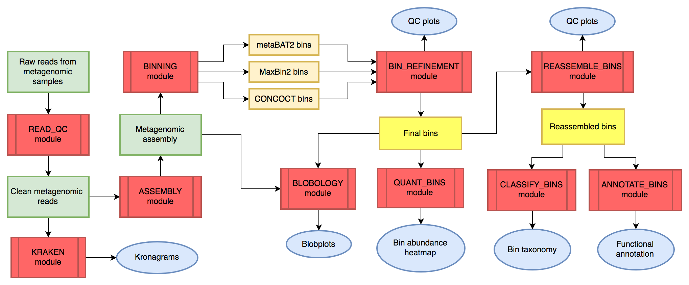
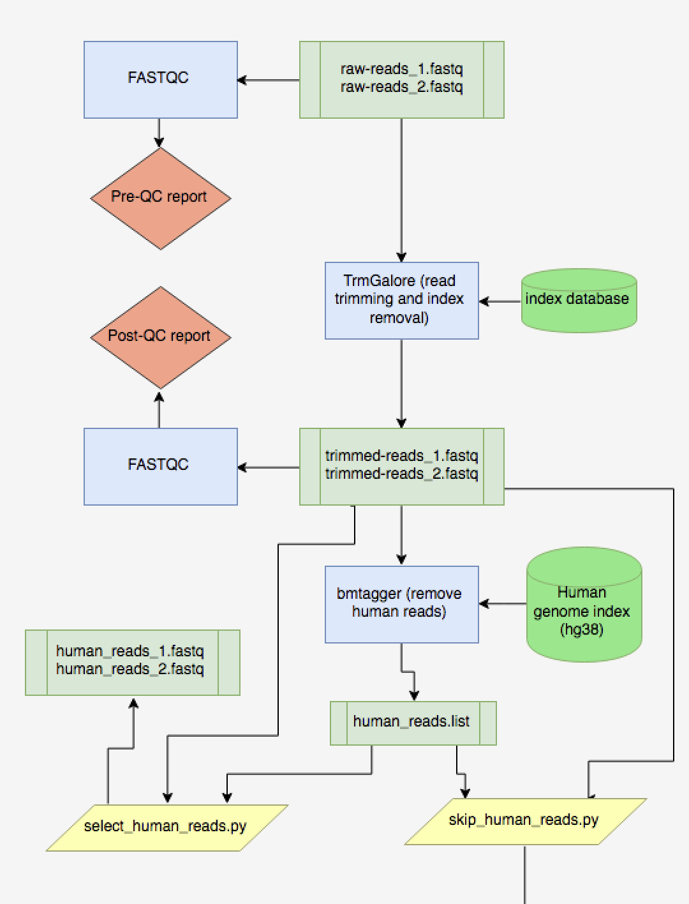

# Module 1: Data Download, Quality Control and Decontamination
---
## Module leads

Boniface Gichuki   
Luicer Anne Ingasia Olubayo

---
# Introduction
After library preparation and sequencing, the resulting raw reads enter the metagenomic bioinformatics workflow, where computational analyses transform large volumes of sequencing data into interpretable biological insights. The schematic below illustrates the overall metagenomic bioinformatics workflow that will be explored throughout this training.



Quality control and decontamination are foundational pre-processing steps in metagenomic analysis because every downstream result depends on the integrity of the raw sequencing data. Before interpreting microbial community structure, functional potential, or reconstructing genomes, researchers must ensure that sequencing reads accurately represent the biological sample rather than technical artefacts.

Shotgun metagenomic sequencing generates millions of short DNA reads originating not only from microbes, but also potentially from host tissue, environmental contaminants, reagent impurities, and sequencing artefacts. Low-quality bases, adapter contamination, PCR duplicates, uneven coverage, and host DNA contamination can all distort taxonomic profiling, functional inference, and genome assembly. If these issues are not addressed, they may lead to false detection of taxa, biased functional profiles, and poor-quality metagenome-assembled genomes (MAGs).

Quality control therefore serves two essential purposes:
1.	Technical validation — ensuring sequencing quality meets analytical standards.
2.	Biological reliability — ensuring observed signals reflect true microbial composition rather than contamination or artefacts.

In this module, participants will learn how to download shotgun metagenomic data from ENA, organize raw sequencing files, assess read quality, trim sequencing artefacts, remove host contamination, and interpret quality reports. These skills provide the foundation required for reproducible downstream analyses such as taxonomic profiling, functional annotation, and genome-resolved metagenomics.

---

## Goal of this module
The goal of this module is to prepare raw shotgun metagenomic sequencing reads for downstream microbiome analysis by performing quality control, read trimming, and host decontamination. This is because poor-quality or contaminated reads can lead to inaccurate taxonomic and functional profiles, contaminant-driven genome assemblies, and misleading biological conclusions. Quality control is therefore essential before any downstream metagenomic analysis.

## Learning outcomes

By the end of this module, participants will be able to:
1.	Download shotgun metagenomic sequencing data from ENA.
2.	Interpret FASTQ file structure and sequencing quality metrics.
3.	Assess sequencing quality using FastQC and MultiQC.
4. Perform adapter trimming and read filtering.
5.	Remove host contamination from metagenomic datasets.
6.	Evaluate how preprocessing affects downstream metagenomic analyses.
7.	Understand the importance of reproducible workflows in microbiome research.
___
## Key tools used in this module

> **Tools introduced in this module**
>
> **FastQC** – sequencing quality assessment for individual sequencing files  
> **MultiQC** – aggregation of quality control reports across multiple samples  
> **TrimGalore** – adapter trimming and read quality filtering  
> **Bowtie2** – alignment-based host DNA removal  
> **metaWRAP** – workflow automation for metagenomic preprocessing

---
# Part I — Understanding the data before cleaning it
Before running any software, it is important to understand the structure and characteristics of sequencing data.

1. What is a FASTQ file?
A FASTQ file is the standard format used to store raw sequencing reads. Each read consists of four lines:

Example:
```text
@SEQ_ID
ACGTAGCTAGCT
+
FFFFFFFFFFFF
```

These four lines represent:
- Read identifier
- DNA sequence
- Separator (+)
- Quality scores

The quality scores represent the probability that each base was called incorrectly during sequencing.

Low-quality bases increase the likelihood of incorrect alignments and misclassification during downstream taxonomic or functional analyses.

2. Sequencing platforms influence quality patterns

Different sequencing platforms produce different error profiles:
- Illumina sequencing → short reads with relatively low error rates
- Long-read platforms (e.g., ONT, PacBio) → longer reads with higher error rates
- PCR amplification → potential amplification bias
- DNA extraction kits → potential reagent contamination

> **Important**
>
> Upstream laboratory decisions (DNA extraction methods, library preparation, and sequencing platform) often influence the quality patterns observed during computational preprocessing.

3. Common sources of contamination
Metagenomic datasets may contain sequences originating from multiple sources:
- host DNA (e.g. human reads in gut microbiome samples)
- reagent contamination from extraction kits
- environmental contamination during sampling or handling
- index hopping or cross-sample contamination during sequencing

A well-known example of reagent contamination affecting microbiome studies is described in:

> **Key reference**
>
> Salter SJ et al. (2014). *Reagent and laboratory contamination can critically impact sequence-based microbiome analyses.* BMC Biology.


### Prepare directories
Before beginning the analysis, create a structured directory layout to organize raw data, quality reports, and processed reads.
```bash
mkdir -p RAW_READS \
         QC/fastqc_raw QC/multiqc_raw \
         QC/fastqc_trimmed QC/multiqc_trimmed \
         QC/fastqc_dehosted QC/multiqc_dehosted \
         TRIMMED_READS DEHOSTED_READS HOST_REMOVAL
```
The project structure should look like this:
```bash
project/
    ├── RAW_READS/
    ├── QC/
    │   ├── fastqc_raw/
    │   ├── multiqc_raw/
    │   ├── fastqc_trimmed/
    │   ├── multiqc_trimmed/
    │   ├── fastqc_dehosted/
    │   └── multiqc_dehosted/
    ├── TRIMMED_READS/
    ├── DEHOSTED_READS/
    └── HOST_REMOVAL/
```

---
# Part II — Downloading data from ENA
The International Nucleotide Sequence Database Collaboration (INSDC) consists of three synchronized global archives:

- National Center for Biotechnology Information (NCBI) (USA)
- European Nucleotide Archive (ENA) (UK) 
- DNA Data Bank of Japan (DDBJ).

These repositories mirror each other’s data, allowing sequencing datasets to be downloaded from any of them.

In this training, we will download shotgun metagenomic sequencing reads from ENA.
 
 ## Step 1a — Download a single sample using wget
Example command for downloading paired-end reads:
 ```bash
 cd /path_to_your_folder
 wget -c ftp://ftp.sra.ebi.ac.uk/vol1/fastq/SRR305/019/SRR30598619/SRR30598619_1.fastq.gz
 wget -c ftp://ftp.sra.ebi.ac.uk/vol1/fastq/SRR305/019/SRR30598619/SRR30598619_2.fastq.gz
 ```
The -c  option allows interrupted downloads to resume.

Move the downloaded files into the raw reads directory and check the contents:
```bash
mv *.fastq.gz RAW_READS/

ls RAW_READS
	SRR30598619_1.fastq.gz
	SRR30598619_2.fastq.gz
	SRR30598621_1.fastq.gz
	SRR30598621_2.fastq.gz
	SRR30598622_1.fastq.gz
	SRR30598622_2.fastq.gz
```

 ## Step 1b — Download multiple samples using ENA downloader
 If many samples need to be downloaded, an automated downloader can be used.

Create a text file containing one run accession per line:
 ```text
 run_accession_list.txt
 ```
Example contents:
```text
SRR30598619
SRR30598621
SRR30598622
```

Load the ENA downloader module:
 ```bash
 module load enadownloader/v2.3.5-4ac05c8f
 ```
Run the downloader:
 ```bash
 enadownloader -t run -i run_accession_list.txt -o RAW_READS -d
```
 This generates:
 ```code
RAW_READS/
     ├── SRR30598619_1.fastq.gz
     ├── SRR30598619_2.fastq.gz
     ├── SRR30598621_1.fastq.gz
     ├── SRR30598621_2.fastq.gz
     ├── SRR30598622_1.fastq.gz
     └── SRR30598622_2.fastq.gz
```

The downloaded FASTQ files are written directly to the `RAW_READS` directory, which serves as the starting point for downstream quality control.

---

# Part III — Initial quality control
In this section, we apply the tools introduced earlier to perform the key preprocessing steps required before downstream metagenomic analysis.

The major preprocessing steps in shotgun metagenomic analysis are illustrated below. 


## Step 1 — Run FastQC
FastQC provides an overview of sequencing quality metrics.
```bash
fastqc RAW_READS/*.fastq.gz -o QC/fastqc_raw
```
> **What this command does**
>
> Runs FastQC on all FASTQ files in the `RAW_READS` directory and writes the reports to `QC/fastqc_raw`.

FastQC evaluates:
- per-base sequence quality
- adapter contamination
- overrepresented sequences
- GC content
- sequence duplication levels

FastQC produces an HTML report for each sample.

Example report:



## Step 2 — Combine reports using MultiQC
MultiQC aggregates multiple FastQC reports into a single summary.
```bash
multiqc QC/fastqc_raw -o QC/multiqc_raw
```
The output multiqc_report.html allows cross-sample comparison and helps identify:
- outlier samples
- systematic contamination
- batch effects
- global sequencing quality trends

---------------------------
# Part IV - Correcting identified problems
After quality assessment, the next step is to correct the identified issues.

1. Adapter trimming and quality filtering
2. Host DNA removal

Together, these steps produce high-quality microbial reads suitable for downstream analysis.

In this section we perform these steps manually. In the next section, we will demonstrate how the same logic can be automated using the metaWRAP read_qc pipeline.


## 1. Adapter trimming and quality filtering
During library preparation, short adapter sequences are attached to DNA fragments to enable sequencing. These adapters may remain in sequencing reads, and read quality often declines toward the 3′ end. Trimming removes these technical artefacts, improving mapping accuracy and downstream analyses.


### Step 1 — Run TrimGalore
TrimGalore performs adapter removal and quality trimming.
```bash
trim_galore --paired RAW_READS/SRR30598619_1.fastq.gz RAW_READS/SRR30598619_2.fastq.gz --output_dir TRIMMED_READS
  ```
Typical output files:
```text
	TRIMMED_READS/SRR30598619_1_val_1.fq.gz
	TRIMMED_READS/SRR30598619_2_val_2.fq.gz
	TRIMMED_READS/SRR30598619_1_trimming_report.txt
	TRIMMED_READS/SRR30598619_2_trimming_report.txt
```

These trimmed reads will be used for host removal.

## 2. Post-trimming quality validation
Quality correction should always be verified.

```bash
fastqc TRIMMED_READS/SRR30598619_1_val_1.fq.gz TRIMMED_READS/SRR30598619_2_val_2.fq.gz -o QC/fastqc_trimmed
multiqc QC/fastqc_trimmed -o QC/multiqc_trimmed
```
Compare the pre-QC and post-QC reports to confirm improvements such as:
- higher base quality scores
- reduced adapter contamination
- fewer overrepresented sequences

Example post-QC report:



## 3. Host DNA removal
In host-associated microbiome datasets, a proportion of sequencing reads may originate from host cells rather than microbes. Removing host DNA is therefore necessary to ensure that downstream analyses focus on microbial sequences.

In the metaWRAP pipeline, host filtering is performed using BMTagger, an alignment-based tool designed to identify and remove host-derived reads. Here we demonstrate the same principle using Bowtie2, which aligns reads to a host reference genome and retains only unmapped reads.

### Step 2 — Build the host genome index
If you do not already have an index for the host genome, build one using Bowtie2.

``` bash
bowtie2-build hg38.fa hg38_index
  ```
This step generates several index files required for alignment.

### Step 3 — Align reads to the host genome
```bash
bowtie2 \
  -x hg38_index \
  -1 TRIMMED_READS/SRR30598619_1_val_1.fq.gz \
  -2 TRIMMED_READS/SRR30598619_2_val_2.fq.gz \
  --very-sensitive \
  --threads 8 \
  --un-conc-gz DEHOSTED_READS/SRR30598619_dehosted.fastq.gz \
  -S HOST_REMOVAL/SRR30598619_host_alignment.sam
  ```
This command:
- aligns reads against the host genome
- stores host-aligned reads in the SAM file
- writes unaligned paired reads to:

```text
SRR30598619_dehosted.1.fastq.gz
SRR30598619_dehosted.2.fastq.gz
```
These files represent the cleaned microbial reads.


## 4. Validate host removal
Inspect the Bowtie2 alignment summary.

Example Bowtie2 alignment summary:
```text
10000000 reads; of these:
  10000000 (100.00%) were paired; of these:
    8500000 (85.00%) aligned concordantly
    1500000 (15.00%) aligned 0 times
```
> **Interpretation**
- Reads that aligned concordantly represent sequences that matched the host genome.
- Reads that aligned 0 times did not match the host genome and are retained as microbial reads.
- These unaligned reads are written to the DEHOSTED_READS directory and used for downstream metagenomic analyses.

If extremely high host contamination is observed (>50–80%), it may indicate:
- low microbial biomass
- inefficient DNA extraction
- sample preparation issues

Running FastQC again on the dehosted reads can provide a final validation of read quality.

```text
RAW READS
    ↓
FastQC (initial quality check)
    ↓
MultiQC (cross-sample QC overview)
    ↓
TrimGalore (adapter trimming + quality filtering)
    ↓
FastQC + MultiQC (post-trim validation)
    ↓
Bowtie2 host filtering
    ↓
DEHOSTED CLEAN READS
```


These cleaned reads are used for downstream analyses such as:
- taxonomic profiling
- functional annotation
- metagenome assembly
- metagenome-assembled genome (MAG) reconstruction

---
# Using a workflow:
For a small number of samples, running preprocessing steps manually helps users understand each stage of the workflow. However, in large metagenomic projects containing hundreds of samples, manual execution becomes inefficient.

Workflow systems automate these tasks and ensure reproducibility.

metaWRAP is a flexible pipeline designed for genome-resolved metagenomic analysis. It integrates multiple tools into modular workflows for read preprocessing, assembly, taxonomic profiling, binning, and functional annotation.

```
The following schematic illustrates the preprocessing workflow required to generate high-quality microbial reads.
```


Each module in metaWRAP can be run independently, allowing researchers to incorporate only the steps relevant to their analysis.

The read_qc module performs read trimming and host decontamination in an automated pipeline.


To run the preprocessing using the metaWRAP pipeline

```bash
metawrap read_qc \
-1 SRR30598619_1.fastq \
-2 SRR30598619_2.fastq \
-t 24 \
-o READ_QC/SRR30598619 \
-x hg38
```

For more details on the metaWRAP qc modules refer to:
[Module1_QC_metaWRAP.md](Module1_QC_metaWRAP.md).


> **Important reference:** 
Uritskiy GV, DiRuggiero J, Taylor J. MetaWRAP-a flexible pipeline for genome-resolved metagenomic data analysis. Microbiome. 2018 Sep 15;6(1):158. doi: 10.1186/s40168-018-0541-1. PMID: 30219103; PMCID: PMC6138922. https://link.springer.com/article/10.1186/s40168-018-0541-1

