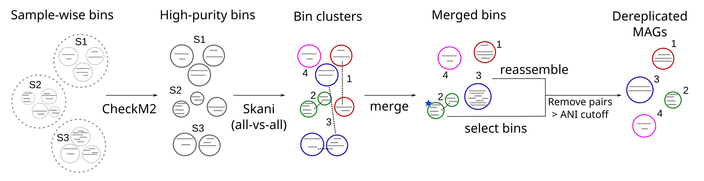

# Module 4: Building a Custom Microbiome Database 
---

## Module lead
Bonface Gichuki      

---

## Introduction
After generating high-quality MAGs in **Module 2**, the next major task in genome-resolved metagenomics is to remove redundancy and construct a non-redundant genome set. Metagenomic binning often produces multiple MAGs that represent the same or highly similar microbial species across samples. To ensure accurate representation of microbial diversity during read mapping, these genomes must be dereplicated into species-level representative genomes.

---

## Goal of this module
The goal of this module is to demonstrate how custom microbiome reference databases are constructed through genome dereplication.
In this module, participants will learn how dereplication is performed using MAGmax, and how to interpret the resulting set of species-level representative genomes.

---

## Learning outcomes

By the end of this module, participants will be able to:

1. Explain the need for genome dereplication in metagenomics
2. Understand how genomes are clustered into species-level groups
3. Perform genome dereplication using MAGmax
4. Interpret dereplication outputs and representative genome selection
5. Understand the concept of custom microbiome reference databases

---
### Big picture: How MAGmax performs genome dereplication
The workflow for clustering genomes and selecting species-level representatives using MAGmax can be summarized as shown below. 


---

## Part I - Genome dereplication in metagenomics

As introduced above, genome collections generated from metagenomic assembly often contain redundant genomes, arising from:

- The same species reconstructed across multiple samples
- Closely related strains
- Variation in genome completeness and quality

Dereplication is the process of:

- Comparing genomes based on similarity
- Clustering them into species-level groups
- Selecting a single representative genome per cluster

This ensures that downstream analyses (such as read mapping) are performed on a non-redundant and biologically meaningful genome set.

## Part II - Dereplication using MAGmax 

In this section we demonstrate genome dereplication using MAGmax, a tool designed to enhance genome recovery and reduce redundancy across metagenomic datasets.

MAGmax clusters genomes based on similarity and selects high-quality representatives for each species-level cluster.

---
# Input data

This module uses the high-quality MAGs generated in Module 2.

Example input: CheckM2 statistics (checkm2_postqc_Completeness and checkm2_postqc_Contamination) and file path to the 745 high quality MAGs:

---
### Step 1 — Run MAGmax dereplication

```bash
    magmax \
        -b course_data_2026/Module3/MAGs/cleaned_fasta/cleaned_fasta \
        -i 95 \
        -c 90 \
        -p 95 \
        -q course_data_2026/Module3/MAGs/checkm2_results/checkm2/genome_quality.tsv \
        --no-reassembly \
        -t 24 \
        -f fa
```

By default, an output directory named mags_90comp_95purity will be created, where 90 and 95 correspond to the user-specified completeness and purity thresholds used to select final bins. User can also specify the output directory with the -o option.

The output directory contains dereplicated bins, a text file listing the completeness and contamination scores for each bin as calculated by CheckM2 (similar to genome_quality.tsv), and memberships file (memberships.tsv) listing members for each selected representative.

---
## Part III — Custom microbiome reference database
The 349 representative genomes generated after dereplication form a custom microbiome reference genome database, specific to this dataset.

In this training course, read-based taxonomic profiling will be performed using the GTDB r220 reference database with Sylph. 

However, an alternative approach would be to use a custom, study-specific database such as this one.

Such databases can provide:

- Improved resolution of closely related microbial species
- Better representation of study-specific species
- Increased sensitivity for detecting low-abundance organisms

Note: Profiling metagenomic reads against this custom database is beyond the scope of this module, which focuses on demonstrating genome dereplication and database construction.

## Summary

In this module, we introduced the process of genome dereplication in metagenomics.

Using MAGmax, we showed how to:

- Cluster genomes into species-level groups
- Reduce redundancy in genome collections
- Generate representative genomes

Starting from 745 high-quality MAGs, we obtained 349 species-level representative genomes, which together form a custom microbiome reference database.

While this course uses GTDB r220 for taxonomic profiling, this module highlights how custom, study-specific genome databases can be constructed as an alternative approach for higher-resolution microbiome analysis.

---

**Important reference:** Arangasamy Yazhini, Johannes Söding, Enhancing genome recovery across metagenomic samples using MAGmax, Bioinformatics (2025), https://doi.org/10.1093/bioinformatics/btaf538.

GitHub: https://github.com/soedinglab/MAGmax

---
