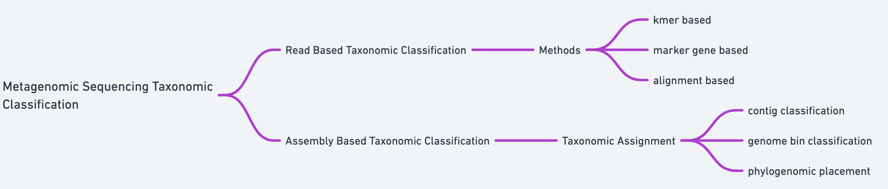
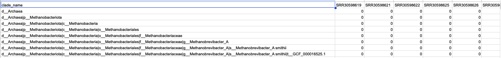

# Module 4: Read-Based vs Assembly-Based Taxonomic Profiling 
---

## Module leads
Bonface Gichuki      
Luicer Anne Ingasia Olubayo

---

## Introduction

After preprocessing sequencing reads in **Module 1** and reconstructing genomes through assembly and binning in **Module 2**, the next major task in metagenomic analysis is **taxonomic annotation** — determining which microorganisms are present in a sample.

Taxonomic profiling in metagenomics is generally performed using two complementary strategies:

1. **Read-based taxonomic profiling**
2. **Assembly-based taxonomic annotation**

Read-based approaches classify sequencing reads directly against reference databases to estimate microbial community composition. Assembly-based approaches instead assign taxonomy to reconstructed genomic sequences such as contigs or **metagenome-assembled genomes (MAGs)**.

Both strategies are widely used in microbiome research and provide complementary insights into microbial communities.

---

## Goal of this module

The goal of this module is to demonstrate how **taxonomic profiling is performed in metagenomic workflows**, using both read-based and genome-based approaches.

In this module, participants will learn how taxonomic annotation can be performed using the **metaWRAP pipeline**, as well as alternative standalone tools commonly used in metagenomics.

---

## Learning outcomes

By the end of this module, participants will be able to:

1. Explain the difference between **read-based and assembly-based taxonomic profiling**
2. Perform read-based taxonomic classification using **metaWRAP kraken**
3. Assign taxonomy to reconstructed genomes using **metaWRAP classify_bins**
4. Interpret taxonomic classification outputs
5. Understand when each method is appropriate
6. Identify alternative standalone tools for taxonomic profiling

---
### Big picture: Where taxonomic annotation fits in the pipeline
The metagenomic workflow covered in this training course can be summarized as:


---

## Part I — Taxonomic profiling approaches

As introduced above, taxonomic annotation in metagenomics can be performed either directly on sequencing reads or on reconstructed genomes, such as metagenome-assembled genomes (MAGs).

In practice, different computational tools are designed for each type of input data. Below we introduce the main tools used for:

- **Read-based taxonomic profiling**
- **Genome-level taxonomic classification**


### Read-based taxonomic profiling

Read-based taxonomic profilers classify sequencing reads by comparing them to reference databases. These tools estimate the composition of microbial communities without requiring genome assembly.

Several computational approaches are commonly used to classify sequencing reads.

---

#### 1. Marker gene–based profilers

Marker gene methods classify reads by mapping them to **taxonomically informative marker genes** that uniquely identify microbial lineages.

Examples include:

| Tool | Description |
|------|-------------|
| **MetaPhlAn** | Uses clade-specific marker genes to estimate microbial relative abundance |
| **mOTUs** | Uses universal single-copy marker genes to detect both known and unknown microbial species |

**Strengths**

- High taxonomic precision  
- Reduced false positives  
- Efficient for community composition profiling  

---

> **Important reference:** Truong DT, Franzosa EA, Tickle TL, Scholz M, Weingart G, Pasolli E, Tett A, Huttenhower C, Segata N. MetaPhlAn2 for enhanced metagenomic taxonomic profiling. Nat Methods. 2015. https://doi.org/10.1038/nmeth.3589

#### 2. k-mer–based classifiers

These tools classify reads by matching short subsequences (*k-mers*) to reference genome databases.

Examples include:

| Tool | Description |
|------|-------------|
| **Kraken2** | Uses exact k-mer matches and a Lowest Common Ancestor (LCA) algorithm for classification |
| **Bracken** | Improves species-level abundance estimation from Kraken results |
| **Sylph** | A sketch-based metagenomic profiler that uses genome sketches to rapidly estimate species composition and genomic similarity from sequencing reads |
| **Phanta** | Fast k-mer-based profiler for sensitive taxonomic assignment |
| **Centrifuge** | Uses compressed indexing for efficient classification with lower memory requirements |

**Strengths**

- Extremely fast classification  
- Suitable for large metagenomic datasets  
- Sensitive detection of many taxa  

> **Important reference:** Wood DE, Salzberg SL. Kraken: ultrafast metagenomic sequence classification using exact alignments. Genome Biol. 2014 https://doi.org/10.1186/gb-2014-15-3-r46 & Shaw, J., Yu, Y.W. Rapid species-level metagenome profiling and containment estimation with sylph. Nat Biotechnol 43, 1348–1359 (2025). https://doi.org/10.1038/s41587-024-02412-y

---

#### 3. Alignment-based approaches

Alignment-based methods compare reads against reference sequences using traditional sequence alignment.

Examples include:

| Tool | Description |
|------|-------------|
| **DIAMOND + MEGAN** | Aligns reads to protein databases and assigns taxonomy from best matches |
| **Kaiju** | Translates reads into amino acids and aligns them to protein databases |
| **HUMAnN** | Alignment-based approach used primarily for functional profiling |

**Strengths**

- Sensitive detection of distant homologs  
- Useful for detecting evolutionarily distant organisms  

---
#### 4. Read-based strain-level analysis

Some read-based tools analyze metagenomic reads after they have been mapped to reference genomes or metagenome-assembled genomes (MAGs). These approaches allow investigation of **microbial populations at the strain (or subspecies) level** rather than only identifying which species are present.

Examples include:

| Tool | Description |
|------|-------------|
| **inStrain** | Analyzes mapped metagenomic reads to measure nucleotide variation and characterize microbial populations at the strain level |

Such tools are commonly used after taxonomic profiling to investigate **within-species diversity and population structure** in microbial communities.

> **Important reference:** Olm, M.R., Crits-Christoph, A., Bouma-Gregson, K. et al. inStrain profiles population microdiversity from metagenomic data and sensitively detects shared microbial strains. Nat Biotechnol (2021). https://doi-org.eux.idm.oclc.org/10.1038/s41587-020-00797-0
---

### Genome-level taxonomic classification tools

Taxonomy can also be assigned to **assembled genomes or metagenome-assembled genomes (MAGs)** generated during assembly-based analysis.

Because these tools operate on longer genomic sequences rather than short reads, they often provide higher taxonomic resolution and enable classification of previously uncharacterized organisms.

Examples include:

| Tool | Description |
|------|-------------|
| **GTDB-Tk** | Classifies genomes using conserved marker genes and places them within the Genome Taxonomy Database |
| **metaWRAP classify_bins** | Assigns taxonomy to MAGs reconstructed during binning workflows |

Genome-level classification is particularly useful for:

- identifying reconstructed microbial genomes  
- placing novel (or newly identified) organisms within the microbial tree of life  
- linking taxonomy with genome-resolved metabolic potential  

> **Important reference:** Tran Q, Phan V. Assembling Reads Improves Taxonomic Classification of Species. Genes (Basel). 2020 Aug 17;11(8):946. doi: 10.3390/genes11080946.
& Chaumeil, P. A., Mussig, A. J., Hugenholtz, P. & Parks, D. H. GTDB-Tk v2: memory friendly classification with the genome taxonomy database. Bioinformatics 38, 5315-5316 (2022). https://doi.org/10.1093/bioinformatics/btac672
---

## Summary of taxonomic annotation approaches

| Approach | Input data | Example tools | Typical purpose |
|----------|-----------|---------------|----------------|
| **Read-based profiling** | Sequencing reads | MetaPhlAn, Kraken2, Sylph, inStrain | Rapid microbial community profiling |
| **Genome-based classification** | Assembled genomes / MAGs | GTDB-Tk, metaWRAP classify_bins | Genome-level taxonomy assignment |


> In practice, many metagenomic workflows combine multiple approaches. For example, a study might use **MetaPhlAn for precise taxonomic profiling**, **Kraken2 for rapid classification of large datasets**, and **GTDB-Tk for genome-level classification of MAGs reconstructed during assembly-based analysis**.

---

## Key tools used in this module

> **Tools used in this module**

**metaWRAP** – modular pipeline used for genome-resolved metagenomic analysis.  
**Sylph** – k-mer–based read-level taxonomic classifier.
**Krona** – interactive visualization tool for taxonomic classification results.  

metaWRAP provides wrappers for several tools that allow taxonomic annotation within the pipeline.

---

## Part II — Read-based taxonomic classification using Sylph

In this section we demonstrate **read-based taxonomic profiling using Sylph**, a modern sketch-based metagenomic profiler.

Sylph estimates microbial community composition by comparing sequencing reads against a database of **sketched reference genomes**. By using genome sketches rather than full k-mer databases, Sylph enables **very fast taxonomic profiling with low memory requirements**, making it well suited for large metagenomic datasets.

Sylph can estimate:

- microbial taxonomic composition
- approximate relative abundance (including for very low abundant microbial species)
- genomic similarity between reads and reference genomes

---

#### Input data

This module uses the **quality-controlled, dehosted reads generated in Module 1**.

Example input files:
```text
CLEANED_READS/SRR30598619_clean_1.fastq.gz
CLEANED_READS/SRR30598619_clean_2.fastq.gz
```

Sylph requires a **sketch database of reference genomes** that has been prepared in advance.
More details on how to build sketch databases can be found here (https://github.com/bluenote-1577/sylph/wiki/Pre%E2%80%90built-databases)

Example database file:
```text
reference_db/gtdb-r220-c200-dbv1.syldb
```

### Step 1 — Download pre-sketched GTDB r220 database
```text
wget http://faust.compbio.cs.cmu.edu/sylph-stuff/gtdb-r220-c200-dbv1.syldb
```

### Step 2 — Run Sylph profiling (profiling with GTDB-r220)
```bash
sylph profile \
    reference_db/gtdb-r220-c200-dbv1.syldb \
    CLEANED_READS/SRR30598619_clean_1.fastq.gz \
    CLEANED_READS/SRR30598619_clean_2.fastq.gz \
    > sylph_profile.tsv
```

sylph_profile.tsv contain no taxonomic information. 

### Step 3 — Run Sylph taxonomic profiling (Get taxonomic profile)
```bash
sylph-tax taxprof \
	sylph_profile.tsv \
	> SRR30598619_clean_1.fastq.gz.sylphmpa
```

### Step 3 — Examine the output
The command produces a *.sylphmpa file similar to what MetaPhlAn outputs. Each taxonomic rank has an associated taxonomic or sequence abundance.
head -n 20 SRR30598619_clean_1.fastq.gz.sylphmpa 


##### Parameter explanation
```bash
- `profile` – computes k-mer–based similarity / abundance profiles, useful for comparing genomes or samples; it does not assign taxonomy.
- `taxprof (or sylph-tax taxprof)` - performs taxonomic assignment, giving you which organisms are present and their abundances.
- `reference_db/gtdb-r220-c200-dbv1.syldb` – sketch database of reference genomes in GTDB release 220 (GTDB r220)
- `*.fastq.gz` – sequencing reads to classify
- `>` – writes results to an output file
```

Example:



> ##### Interpreting Sylph results
Sylph results can be used to:
- identify dominant microbial taxa present in a sample
- estimate microbial relative abundance
- compare similarity between sequencing reads and reference genomes
- rapidly profile microbial communities in large datasets

Because Sylph uses genome sketches, it can perform fast taxonomic profiling even for very large metagenomic datasets.

## Part III — Assembly-based taxonomic annotation
Assembly-based classification assigns taxonomy to **reconstructed genomes (MAGs)** generated in **Module 2**.

metaWRAP includes the module **classify_bins** for this purpose.

#### Input data
This module uses the refined bins generated in **Module 2**.

Example input directory:
```text
refined_bins/metawrap_bins/
```
Each bin represents a candidate metagenome-assembled genome (MAG).

### Step 2 — Run metaWRAP classify_bins
```bash
metawrap classify_bins \
    -b refined_bins/metawrap_bins \
    -o taxonomy_results \
    -t 16
```
#### Parameter explanation
- `-b` directory containing MAGs to classify
- `-o` output directory for taxonomy results
- `-t` number of CPU threads

#### Output
Example output directory:
```bash
taxonomy_results/
    bin_taxonomy_results.txt
```

Example result:
```text
bin.1   Bacteria;Firmicutes;Clostridia
bin.2   Bacteria;Bacteroidota;Bacteroidia
```
These classifications assign taxonomy to reconstructed genomes.

> #### Interpreting MAG classifications
Taxonomic annotation of MAGs provides insight into which microbial genomes were reconstructed during assembly and binning.

This information can be used to:
- identify dominant microbial genomes in a sample
- investigate microbial diversity
- link taxonomy with metabolic potential
- compare reconstructed genomes across samples

Because classification is performed on reconstructed genomes rather than short reads, assembly-based annotation often provides higher taxonomic resolution.

### Summary

In this module we introduced the two major strategies used for taxonomic profiling in metagenomics:

1.	Read-based classification of sequencing reads
2.	Assembly-based classification of reconstructed genomes

Using the tools demonstrated in this module, we showed how to:
	•	perform read-level taxonomic classification using Sylph
	•	assign taxonomy to reconstructed genomes using metaWRAP classify_bins

We also introduced several standalone tools frequently used in metagenomic research, including MetaPhlAn, Kraken2, inStrain, and GTDB-Tk.

Together, these methods enable researchers to characterize microbial communities and link taxonomic identity with genomic and functional information.

