# Building Phylogenetic Trees

## Learning Objectives

- Understand common methods of phylogenetic tree inference
- Use FastTree for phylogenetic tree inference from alignment data.
- Describe key steps in creating a phylogenetic tree.
- Visualise the tree in iTOL

## Contents
- [Introduction to phylogenetics](#introduction to phylogenetics)
- [Phylogenetic Tree Inference](#phylogenetic-tree-inference)
- [Multiple Sequence Alignments](#multiple-sequence-alignments)
- [Building a Phylogenetic Tree](#building-a-phylogenetic-tree)
- [Summary](#summary)


## Introduction to phylogenetics
If we take molecular data coming from sequencing projects we see our organisms have specific sequence. During this time the organims are evolving and mutations are accumulating in these organisms. These mutations are inherited from one generation to another and the accumulation of mutations essentially leads to speciation events (i.e. branching leading to infection of multiple hosts). One problem is that we don't really see what is happening in the intermediate steps. we don't really know what was the ancestor of each of these species.

**Sequence evolution**: mutations alter the genomes being passed on from generation to generation.

Understanding the genetic diversity, genome plasticity, and recombination patterns of the organism under study is an essential first step before conducting genomic analyses, as these factors influence the choice of analytical methods. In particular, phylogenetic reconstruction strategies vary depending on the evolutionary characteristics of the species. For example, approaches used to infer phylogenetic relationships in Mycobacterium tuberculosis, a largely clonal organism, differ from those applied to more recombinogenic bacteria such as Escherichia coli or Campylobacter. To guide the selection of appropriate methods for phylogenetic analysis, a flowchart outlining recommended strategies based on dataset composition is provided.

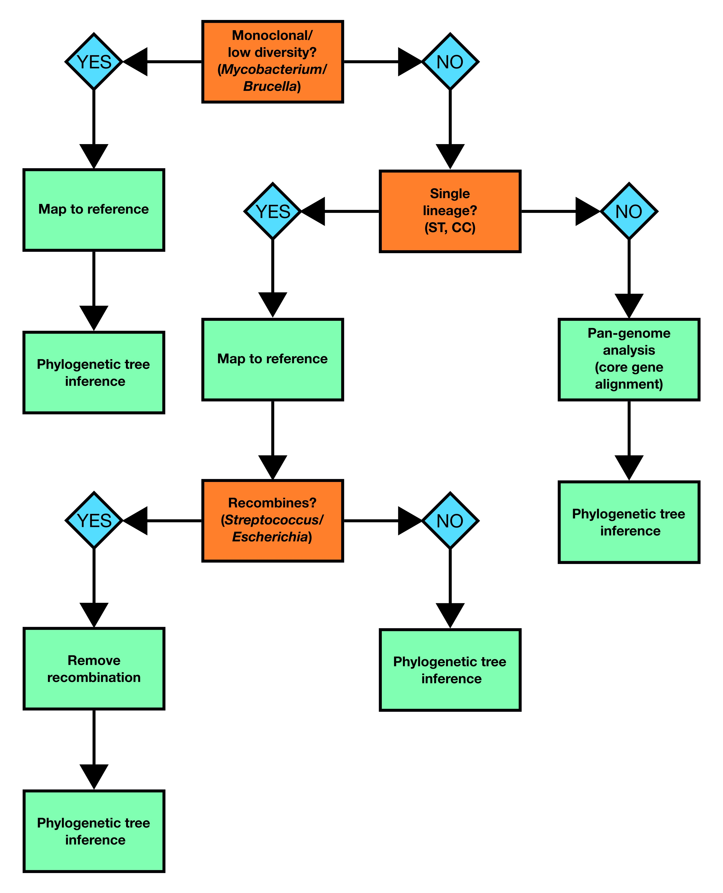

---
## Phylogenetic Tree Inference
---

### What is a phylogenetic tree?

A phylogenetic tree is a graph representing evolutionary history and shared ancestry. It depicts the lines of evolutionary descent of different species, lineages or genes from a common ancestor. A phylogenetic tree is made of nodes and edges, with one edge connecting two nodes.
The topology describes how taxa are connected, independent of branch lengths.

### Terminologies
- **Leaves** (tips) - Represent actual observed data
- **Branches** - In a tree, branches can represent multiple meanings. in order to fully understand the meaning of the tree you need to understand how the tree was built. A branch can mean the divergence time between current species and its hypothetical ancestor (i.e. if you know when the samples were collected, it is possible to reconstruct a timed tree where the nodes are placed in their corresponding times), it can also mean the number of substitutions per site or number of changes between the hypothetical ancestors and the current sampled organism.
- More often than not, samples are collected at the same time, and it might be assumed that their divergence time from their common ancestor is the same. An **ultrametric tree** shows exactly that, where the distance between the root and the tips is the same for all samples.

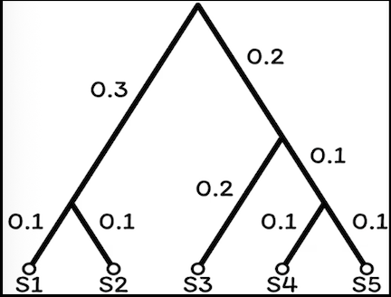

- **Terminal nodes** - Are nodes in the tree connected to only one edge and are usually associated with the data that we have, such as a genome sequence. A node can represent an extinct species or a sampled pathogen. it's also called **tips** or **leaves**.
- **Internal nodes** - represent the most recent common ancestors of groups of terminal nodes. They are not directly observed but are inferred from the genome sequences at the tips of the tree. As a result, any ancestral states reconstructed from a phylogeny are hypothetical. While we cannot directly verify these ancestors, statistical and computational methods allow us to estimate them and assess the confidence of these inferences.
- **root** - The root represents the most recent common ancestor of all samples in the tree. However, phylogenetic trees inferred using time-reversible models are inherently unrooted, meaning they do not specify a direction of evolution. Rooting is therefore a necessary step to interpret evolutionary relationships and generate hypotheses.

 Several approaches can be used to place the root:

 - **Midpoint rooting**: assumes a constant rate of evolution across lineages and places the root at the midpoint of the longest path, producing an **ultrametric tree**.
 - **Outgroup rooting**: uses a distantly related taxon to define the direction of evolution.
 - **Time-based rooting**: incorporates sampling dates or molecular clock models.
 - **Arbitrary rooting**: placing the root at a chosen position when no clear method is available.

- Overall, the placement of the root determines the direction of evolution and can affect the inferred relationships among lineages, although the overall grouping of taxa (clades) remains unchanged.

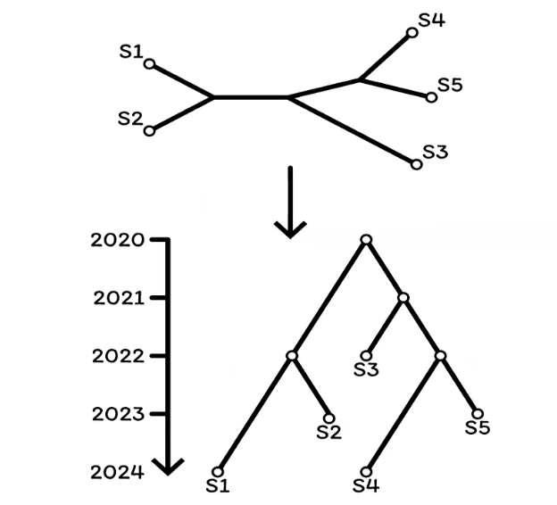

 - Root placement is non-trivial, and several advanced methods have been developed to infer it more reliably. One example is **[RootDigger](https://link.springer.com/article/10.1186/s12859-021-03956-5)**, which was applied in studies of SARS-CoV-2 evolution. This approach uses maximum likelihood to evaluate different root positions under **non-reversible substitution Markov models**, which allow inference of evolutionary direction without requiring an outgroup. It assesses model fit across possible root placements to identify the most likely position, while accounting for variation in evolutionary rates across lineages.

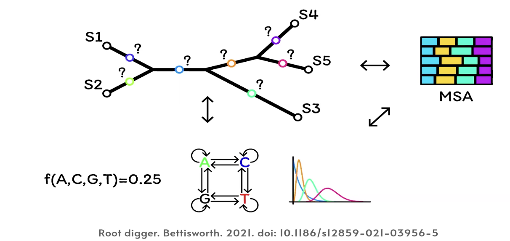

## Exercise 1
- Root this tree by making it ultrametric (a tree in which every species or sample has the same distance to the root)
- All tips must have the same distance from the root (assumes all the data was collected in the present day) i.e. same divergence time from the ancestral state(root)

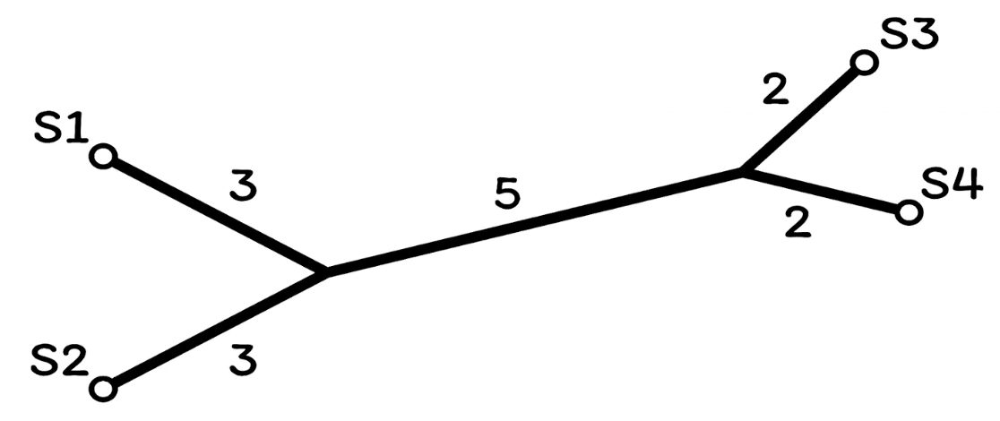


## Tree topology

- **A clade** - Is a set of all sequences/species (terminal nodes) descending from a node/ancestor.

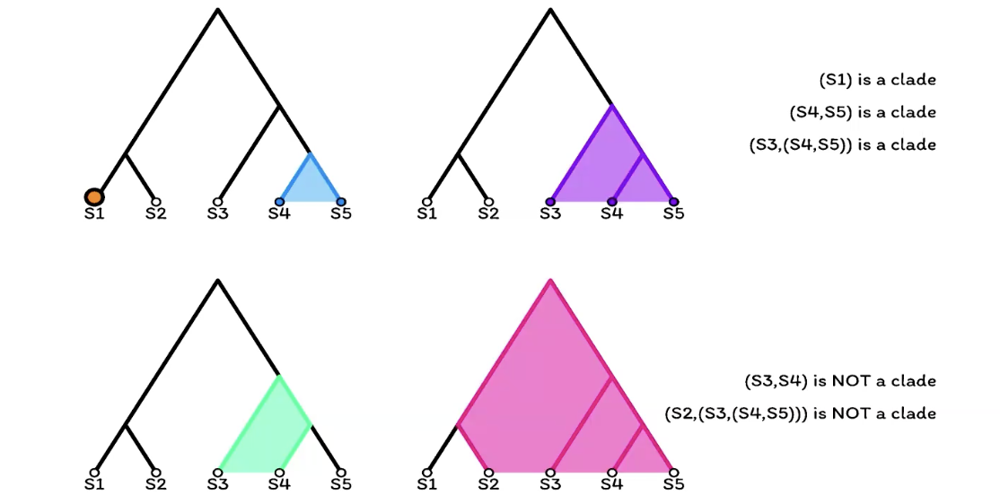

```S1``` is a clade because it descends from itself. ```S3```, ```S4``` and ```S5``` represent a clade because they share a common ancestor.

- Each branch and each node in a rooted tree correspond to one clade. 
- If two trees have the same clade, we say that they have the same topology. 
- If two trees have the same topology and branch lengths, they are the same.

For example the groupings in these trees are the same, therefore they have the same topology and the same length, thus, it is a single tree.

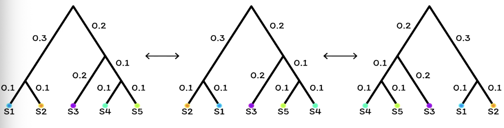

## Exercise 2

- Which of these trees have the same topology?

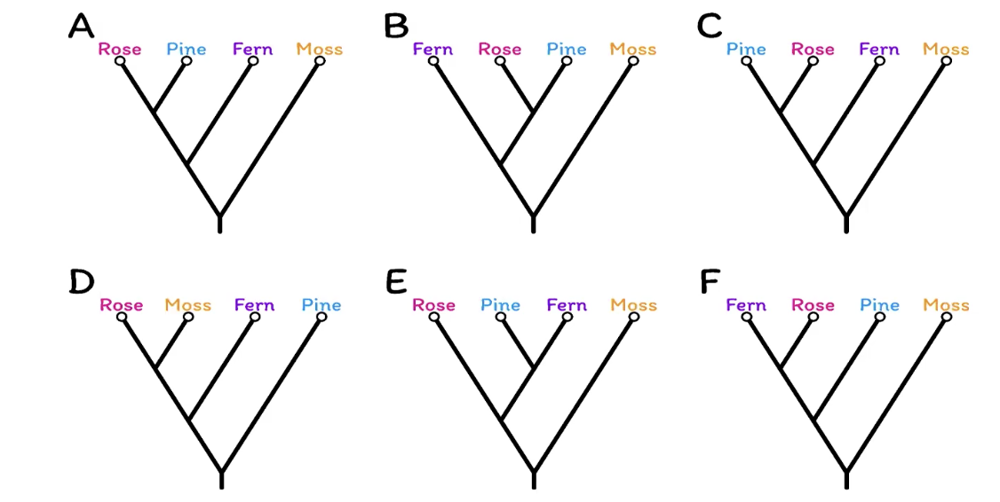


For instance, the terminal nodes of this tree - A, B, C and D - represent sampled organisms. The internal nodes - E and F - are inferred from the data.  In this case, there is also a multifurcation: nodes A, B and E all coalesce to the base of the tree. This can happen due to poor resolution in the data. A well resolved tree only contain a binary split. You can trick different softwares to interpret these kind of multifurcating trees to make them think that they're bifurcating trees

It is assumed that a given ancestor can diverge into two descendants but in practice, due to oversampling and undersampling, phylogenies can show three or more  descendants derived from the same ancestor.

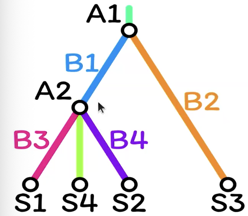

## Phenomenon impacting phylogenetic reconstruction

- **Within-species recombination**: Recombination can cause different genomic regions (loci) to have distinct evolutionary histories, resulting in conflicting phylogenetic signals. This may produce unusually short or long branches. In bacterial genomes, recombination can be accounted for using tools such as ClonalFrameML or Gubbins.
- **Hybridization (or introgression)**: When reconstructing species trees from multiple genes, different genes may support conflicting relationships due to hybridization or gene flow between lineages. This leads to discordance between gene trees and the overall species tree.
- **Incomplete lineage sorting (ILS)**: During rapid speciation, ancestral genetic variation may persist across multiple descendant lineages. As a result, some gene trees may not reflect the true species relationships, retaining ancestral polymorphisms despite species divergence.
- **Horizontal gene transfer, gene duplication, and gene loss**: The movement of genes between organisms, along with gene gain and loss events, can obscure true evolutionary relationships and complicate phylogenetic inference.

---

### Applications of Phylogenetic Trees

Phylogenetic trees are widely used to:

- Understand evolutionary relationships  
- Identify transmission clusters  
- Investigate population structure  
- Track spread of infectious disease (Genomic surveillance)

### Newick Format

- The **Newick format** represents phylogenetic trees as a text format using parentheses. The two child nodes of the same internal node are separated by a ",". At the end of a Newick tree there is always a ";".
- This is usual format for input/output in phylogenetic software

For Example,the newick format of a rooted tree relating to two samples "S1" and "S2" with distances from the root respectively of 0.01 and 0.02, is **(S1:0.01,S2:0.02);**

If we add a third sample "S3" as an outgroup, the tree will look like **((S1:0.01,S2:0.02):0.03,S3:0.04);**

## Exercise 3

- What tree does the following Newick string represent?
((S1:0.4,(S2:0.1, S3:0.1):0.2):0.2,(S4:0.1,S5:0.1):0.3);

1. Try to manually draw this tree
Hint: try to read the innermost parentheses, those are your primary groupings.

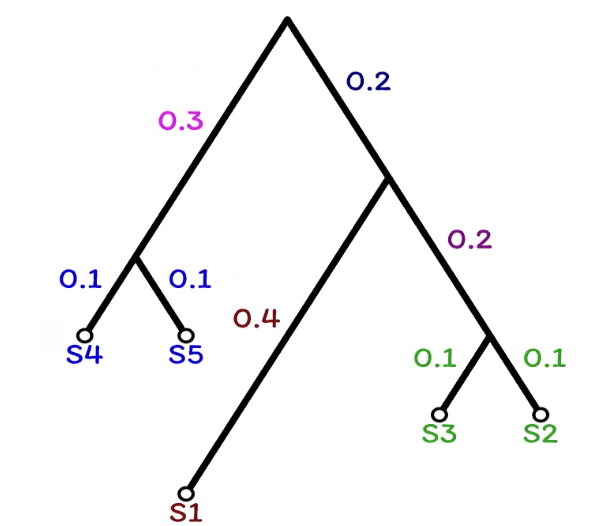

### Methods for Inferring Trees

Common tree inference approaches include:

- Distance-based methods such as Neighour-Joining and UPGMA
- Maximum Parsimony  
- Maximum Likelihood  
- Bayesian inference  

#### Distance-based methods
These are the simplest and fastest phylogenetic methods, they are often a useful way to have a quick look at your data before running more robust phylogenetic methods. Here we infer the evolutionary distances from a multiple sequence alignment. For example, if one nucleotide substitution is observed across 16 informative alignment positions (excluding columns containing gaps or ambiguous bases such as N), the estimated evolutionary distance between the sequences would be approximately 1/16.

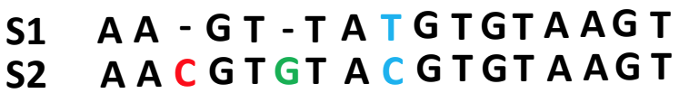

It starts by generating a matrix of pairwise distances (distance matrix) between all samples in a multiple sequence alignment and then infer a phylogenetic relationship using UPGMA or Neigbour-joining.

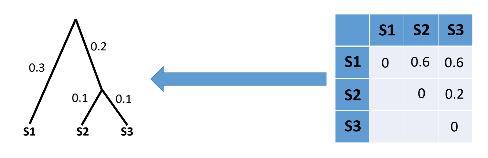

Distance matrix to Neighbour-Joining tree
---

#### Parsimony methods
Maximum parsimony method assume that the best phylogenetic tree requires the fewest number of mutations to explain the data.

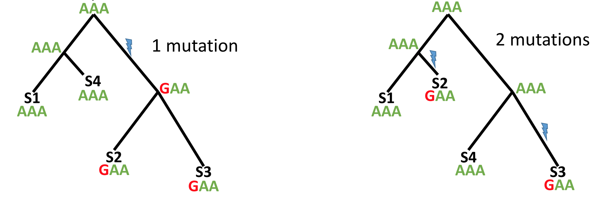

For example, the tree topology on the left only requires one mutation to explain the data, whereas the tree on the right would require two mutations. Therefore, the maximum parsimony tree would be the one on the left.

---
Maximum parsimony is simple method and is very fast to run. However, because its always the shortest tree, compared to the hypothetical “true” tree it will often underestimate the actual evolutionary change that may have occurred.

#### Maximum likelihood methods
Maximum likelihood is the most commonly used phylogentic method in bacterial genomics. It evaluates alternative tree topologies using probabilistic models of genome evolution.
Compared with maximum parsimony, it offers greater statistical flexibility by permitting varying rates of evolution across different lineages and sites. However, this improved modelling approach comes with substantial computational demands than distance-based and Parsimony approaches.  

Common nucleotide substitution models include **Jukes-Cantor** model (JC69), which assumes only a single mutation rate across all nucleotides, and **Hasegawa-Kishino-Yano** model (HKY85), which assumes different mutation rates and accounts for unequal base frequencies. The simplest models to use such as **General time reversible (GTR)** allow different substitution rates for each nucleotide pair.

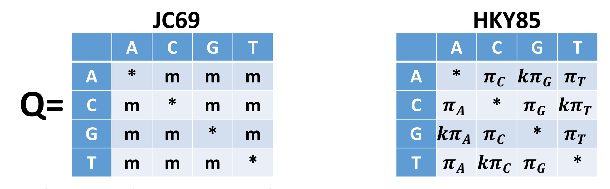

Additional assumptions can also be incorperated into substitution models. A proportion of sites may be specified as constant sites (invariant sites), meaning they are assumed not to undergo mutation. Rate heterogeneity among the remaining sites can be modeled using a gamma distribution, typically discretised into four categories (+G4).

For instance, the model HKY+G4+I account for unequal base frequencies, variation in substitution rates across sites (+G4), and proportion of invariant sites (I).

Maximum likelihood software commonly used to infer phylogenetics include **[FastTree](https://morgannprice.github.io/fasttree/)**, **[IQ-TREE](https://iqtree.github.io/)**, and **[RAxML-NG](https://github.com/amkozlov/raxml-ng)**. **IQ-TREE** is advantageous because it is fast and has broad model support to consider. Its integrated **ModelFinder** function automatically evaluates candidate substitution models and selects the best fitting model for a given dataset, thus removing the decision of which model to pick entirely.

### Assessing Tree Uncertainty (Bootstrap)

Bootstrap analysis evaluates confidence in a tree or individual 6tree branches by sampling a large number (say, 1000) of bootstap alignments. Each of this alignment has the same size as the original alignment, and is obtained by sampling with replacement the columns of the original alignment; in each bootstrap alignment some of the columns of the original alignment will usually be absent, and some other columns would be represented multiple times. We then infer a bootstrap tree from each bootstrap alignment. Because the bootstrap alignments differ from each other and from the original alignment, the bootstrap trees might differ between each other and from the original tree. The **bootstrap support** of a branch in the original tree is the proportion of times in which this branch is present in the bootstrap trees.

---

## Multiple Sequence Alignments

---

Phylogenetic inference requires aligned sequences. These may consist of a single orthologous gene across multiple taxa or whole genome alignments generated by mapping sequence reads to a reference genome. The purpose of alignment is to ensure that homologous nucleotides, those derived from a common ancestral position, are placed in the same column, enabling meaningful evolutionary comparison. One of the most widely used alignment formats in phylogenetic analysis is **FASTA**:

For example: **AACGTGT**

Alignment quality directly affects tree accuracy. Always inspect alignments before proceeding with inference.

N and - characters represent missing data and are interpreted by phylogenetic methods as such e.g. **AA-GT-T** and **AANGTNT**. 

The two most commonly used multiple sequence alignments in bacterial genomics are **reference-based whole genome alignments** and **core genome alignment**. Reference-based approaches align sequence reads to a single high-quality reference genome. In contrast, core genome alignments are generated by comparing genes across isolates and identifying those present in all or nearly all genomes (the core genome). As a general rule of thumb, if a species is extremely clonal (not genetically diverse) and doesn't recombine such as Mycobacterium tuberculosis or Brucella, a suitable reference-based whole genome alignment is often appropriate. However, for genetically diverse species with multiple divergent lineages, such as Escherichia coli, a single reference genome may not adequately capture the diversity present in the dataset. In these cases, it is more appropriate to generate de novo assemblies, annotate them, and infer the pangenome using tools such as **Roary** or **Panaroo**, from which a core genome alignment can be constructed. The same phylogenetic inference methods can then be applied to either type of multiple sequence alignment.

---
## Building a phylogenetic tree
---
### Marker gene based phylogenetic construction
In this section, you will learn how to:
- identify marker genes
- generate multiple sequence alignment
- Build a phylogenetic tree


```
# load modules
mamba activate gtdbtk
mamba activate fasttreemp
```

#### Identify Marker Genes
GTDB-Tk identifies conserved marker genes that are shared across bacteria.

```
gtdbtk identify --genome_dir . -x fa --cpus 24 --out_dir gtdbtk_identify_outdir
```

#### Align Marker genes
This step aligns marker genes across all genomes and produces a multiple sequence alignment

```
gtdbtk align --identify_dir ./gtdbtk_identify_outdir --skip_trimming --skip_gtdb_refs --out_dir gtdbtk_align_outdir --cpus 24
```

#### Unzip the alignment file before building the tree

```
# change directory
cd gtdbtk_align_outdir/align/

# unzip
gunzip *.gz
```

#### Build the phylogenetic tree

The code below builds a phylogenetic tree using maximum likelihood methods and outputs a tree file in newick format.

We will NOT run this command in the classroom, because it takes a long time to run.

```bash
fasttree \
FastTreeMP \
-wag \
-out gtdbtk_fullalign_bacteria.nwk \
gtdbtk_align_outdir/align/gtdbtk.bac120.user_msa.fasta
```
You can go to Phylogenetics/gtdb_phylogenetic_tree and inspect the output file gtdbtk_fullalign_bacteria.nwk. This file can be loaded into iTOL https://itol.embl.de/ for annotation and visualisation. 

### Rooting a phylogenetic tree
Rooting a phylogenetic tree is essential for interpreting evolutionary relationships and providing temporal context to species diversification. While an unrooted tree shows only relationships without direction, a rooted tree represents the evolutionary history of the taxa.

The most common method to root a tree is to include an **outgroup**—a taxon known to be more distantly related to the other sequences in the analysis. Alternatively, a reference genome can be used as an outgroup for all members of a species to establish the root.


## Tree Visualisation Using iTOL
Several tools are available for visualising phylogenetic trees, including FigTree and the R package ggtree. In this course, we will use Interactive Tree of Life (iTOL) because it provides an intuitive web interface for exploring trees and integrating metadata.

To get started create an account at: https://itol.embl.de/ (or sign-in using your Google account).


## Preparing Annotation file

This guide outlines how to colour a phylogenetic tree in iTOL using phylum-level metadata.

You will:

- Extract phylum information from GTDB metadata
- Assign a unique colour to each phylum
- Format the data for iTOL
- Upload the annotation file

#### Step 1: Extract Phylum Information from GTDB Metadata

- Open your GTDB metadata file in excel

```
/Human_Gut_Microbiome_Metagenomics_2026/course_data_2026/Phylogenetics/gtdb_phylogenetic_tree/Bednarski_2025_qcmags_hqMAGs_report_and_metadata.xlsx
```

- Insert a new empty column next to the classification column.

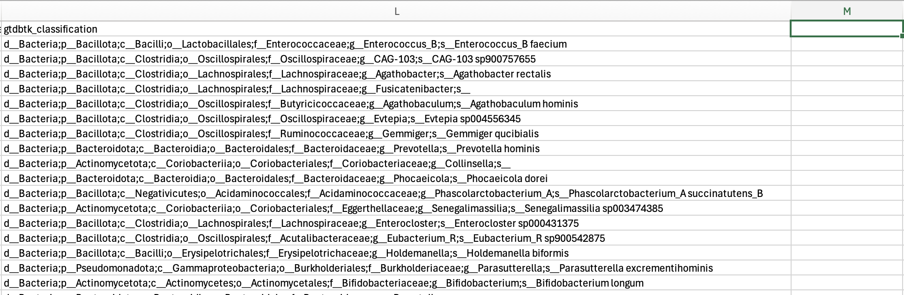

- Extract the phylum-level taxonomy from the classification string into the new column (e.g. values starting with p__)

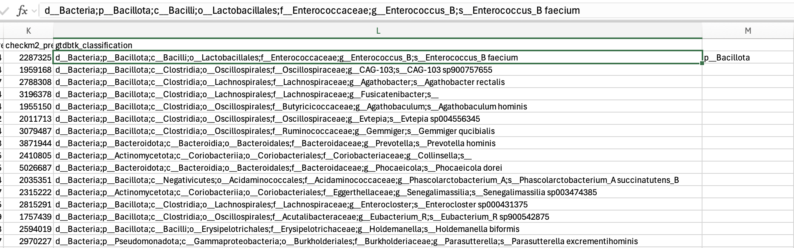

With the cursor in the new cell with the phylum name, go to the Data tab in excel and click Flash-fill to automatically populate the remaining rows

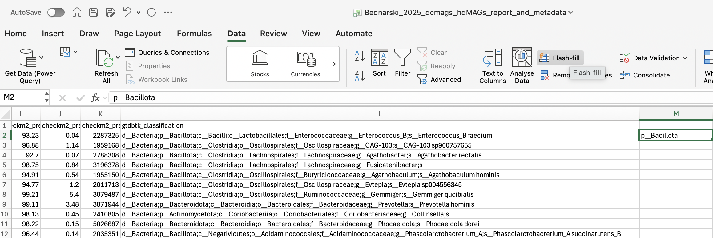

#### Step 2: Create a Clean Working Sheet
Open a new sheet (e.g., Book2).
Copy the sample column and newly created phylum column into Book2

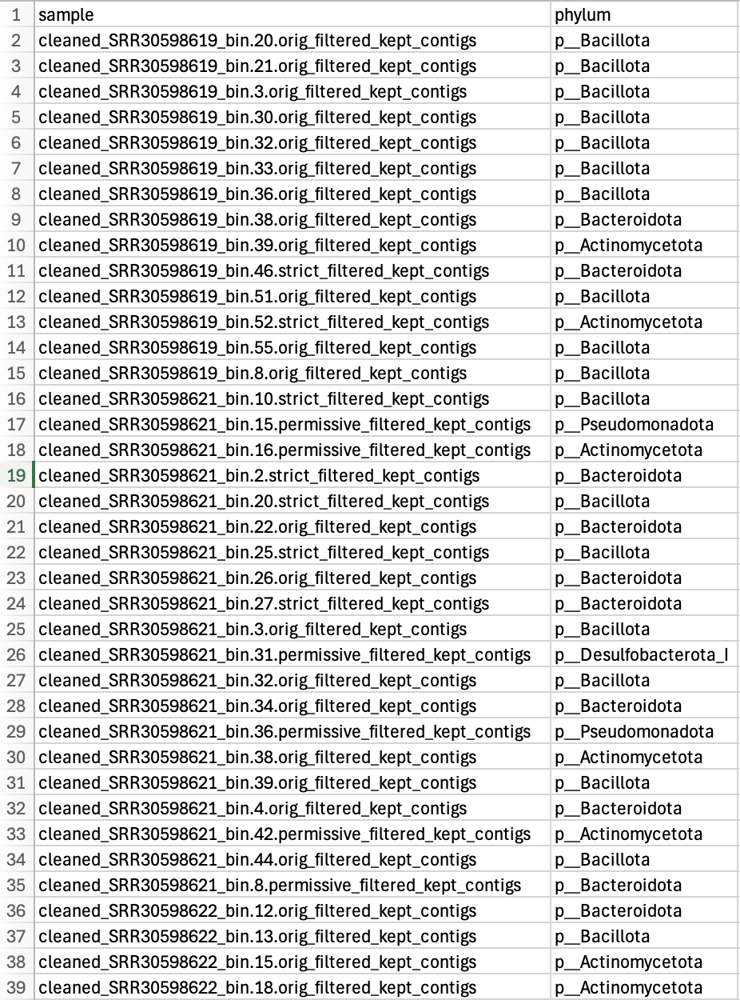

#### Step 3: Assign Colours to Each Phylum

- Replace each phylum name with a hex colour code using Find and Replace.

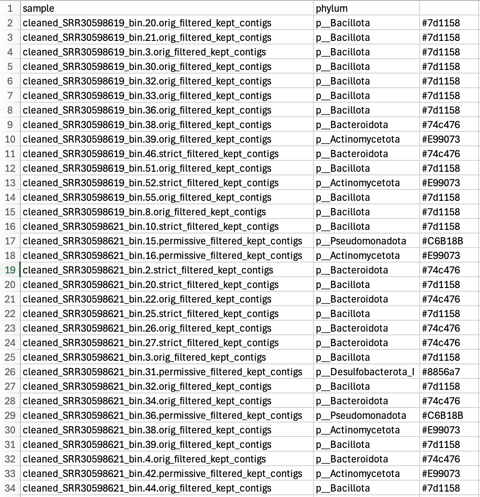

- Combine sample IDs and colour codes into a single column using the formula below and double-click the cursor ``` +```  to populate the remaining rows

 ``` 
 =A2&" "&C2 
 ``` 

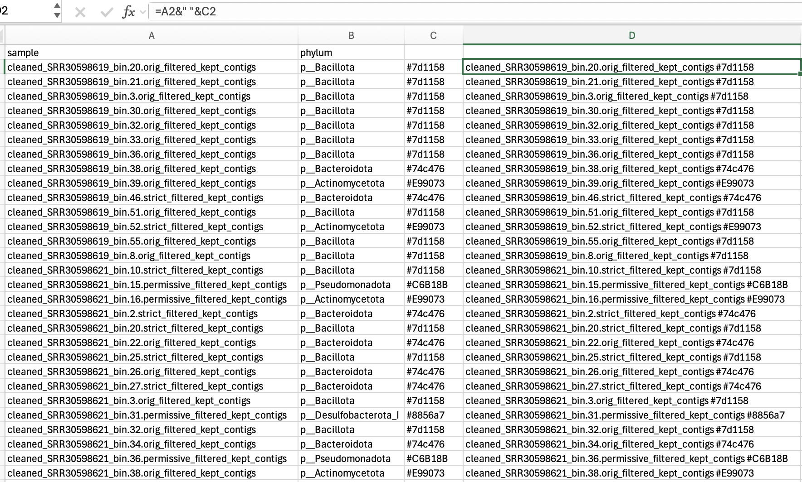

#### Step 4: Format the iTOL Annotation File
 - Open the iTOL annotation file

```
/Human_Gut_Microbiome_Metagenomics_2026/course_data_2026/Phylogenetics/gtdb_phylogenetic_tree/species_category.txt
```
- Locate the line:

```
Actual data follows after the "DATA" keyword    #
```

- Paste the formatted data (sample + colour) directly below this line and save the file using ``` CTRL + S ``` option or ``` CMD + S ``` option

#### Step 5: Format Your Data Correctly

Your data must follow iTOL formatting rules. A typical structure is:

```
cleaned_SRR30598619_bin.20.orig_filtered_kept_contigs #984ea3
cleaned_SRR30598619_bin.21.orig_filtered_kept_contigs #984ea3
```
⚠️ Important:

- Ensure sample IDs match exactly between the tree and annotation file
- Use consistent formatting (no extra spaces or hidden characters)
- Save the file as plain text before uploading to iTOL

## Uploading tree files and metadata
Once you’ve logged into iTOL, you can upload `gtdbtk_fullalign_bacteria.nwk` tree file and annotate it with the metadata 

1. Click on the UPLOAD link in the bottom-right corner of the page:

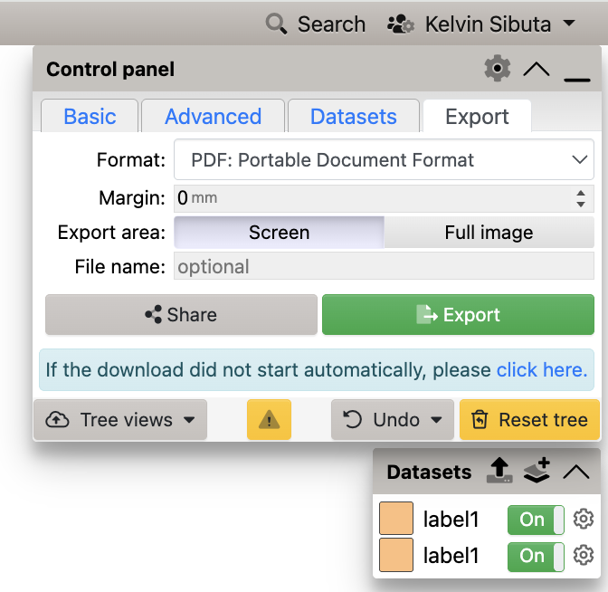

2. Browse Files to upload the tree:

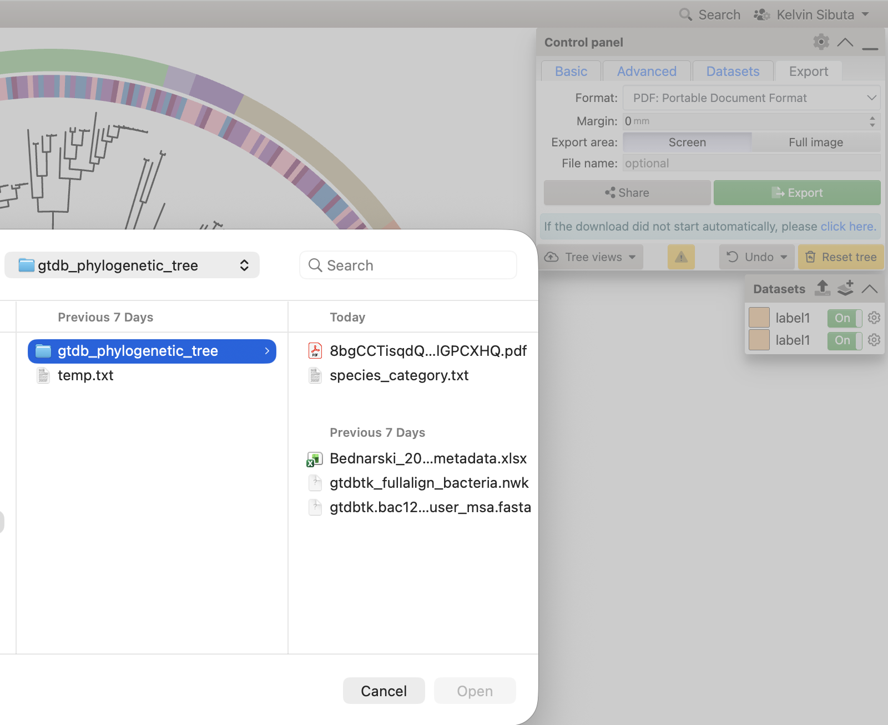

3. This will open a file browser, where you can select the tree file and metadata from your local machine. Go to the gtdb_phylogenetic_tree directory where you have the tree and the species_category file. Click and select the `gtdbtk_fullalign_bacteria.nwk` file. Click Open on the dialogue window after you have selected the file.

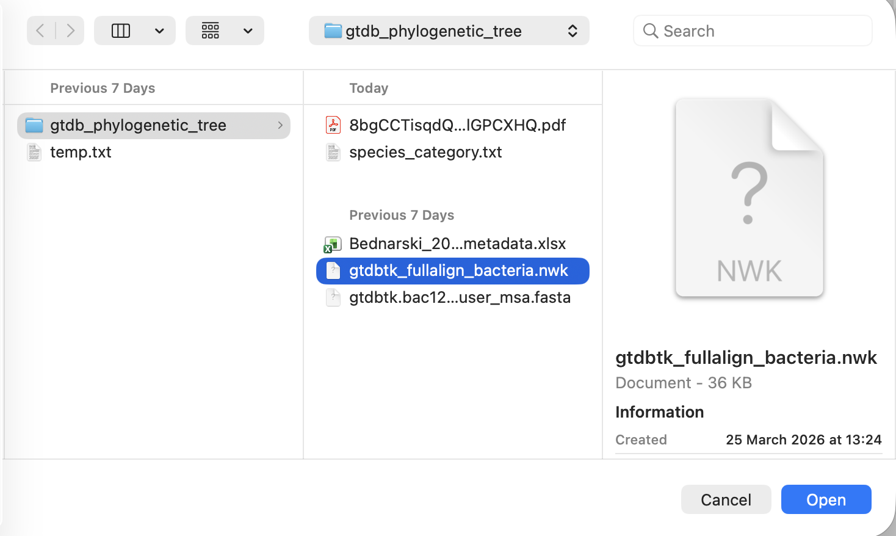

4. The tip labels are still the European Nuclotide Accessions we used to download the FASTQ files. Let’s change the tip labels to the phylum names using `species_category.txt` annotation file.

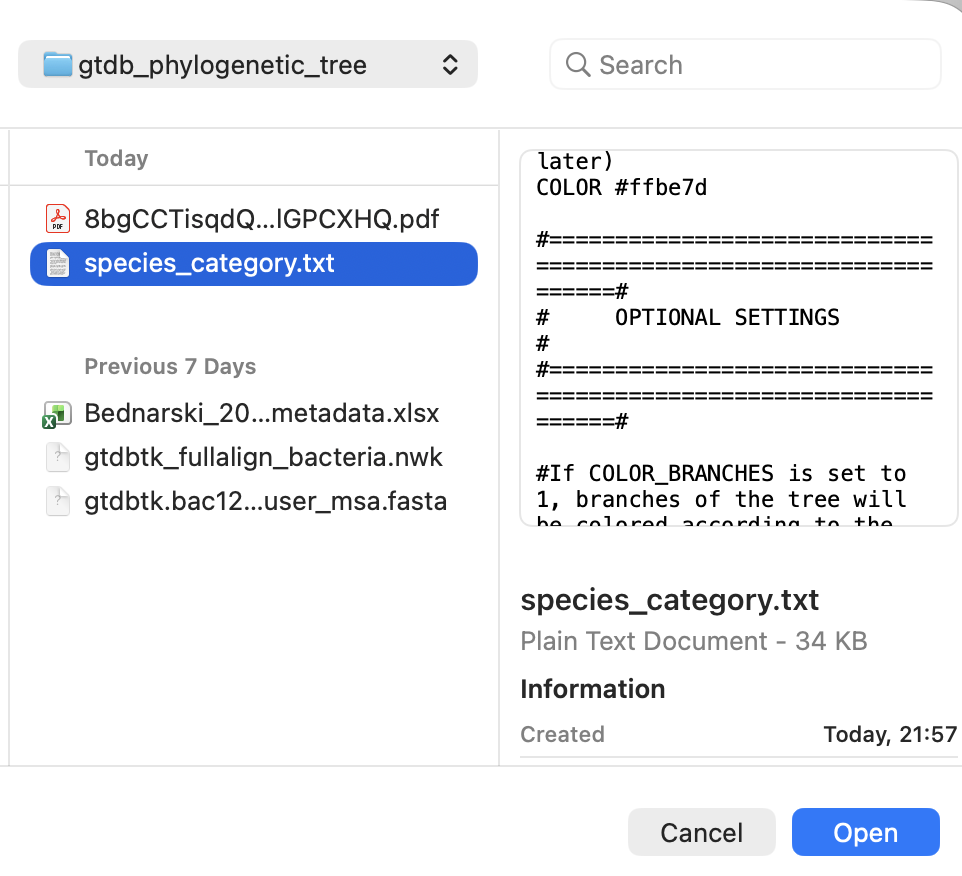

5. From the rooted tree, we can see we have distinct clades within the tree. These are major clades we identified in our dataset. 
Visualise `gtdbtk_fullalign_bacteria.nwk` in iToL and add metadata


## Exporting the tree to your local computer

Once your tree has been fully annotated, adjust any export settings if needed (e.g., resolution, labels, scaling) and click “Export” option in the top menu and select your preferred output format to download the file to your local machine.


You can export the tree in Vector, Bitmap or Text format:


---
## Summary
---
- A phylogeny is made of topology and branch lengths.
- Phylogenetic trees can be rooted or unrooted; binary or with multi furcations; ultrametric and/or timed.
- A phylogeny represents an evolutionary history of a gene, collection of genes, genome.
- The Newick format is used for input and output by phylogenetic software.
- Beware of: hybridization, within-species recombination, lateral gene transfer, gene duplication and losses, and incomplete lineage sorting.
- The approach to reconstructing a phylogenetic tree should be guided by your underlying research question. For example, if the goal is to detect evolutionary pressures on specific genes, careful consideration must be given to sequence selection, alignment quality, and appropriate evolutionary models before and after tree inference.
- Tree inference methods include **neighbor-joining**, **maximum parsimony**, and **maximum likelihood**. The first two methods are simpler and computationally faster but do not fully capture important features of sequence evolution.
- **Maximum likelihood** methods are recommended because they incorporate relevant parameters such as varying substitution rates, invariant sites, and rate heterogeneity across the sequence.
- Regardless of the method used, phylogenetic inference requires a **multiple sequence alignment** as input. To reduce the computational burden of analyzing whole-genome alignments, we can extract only the **variable sites** using the snp-sites software.
- **IQ-TREE** is a widely used software for maximum likelihood tree inference and can take as input the variable sites extracted from the previous step.
